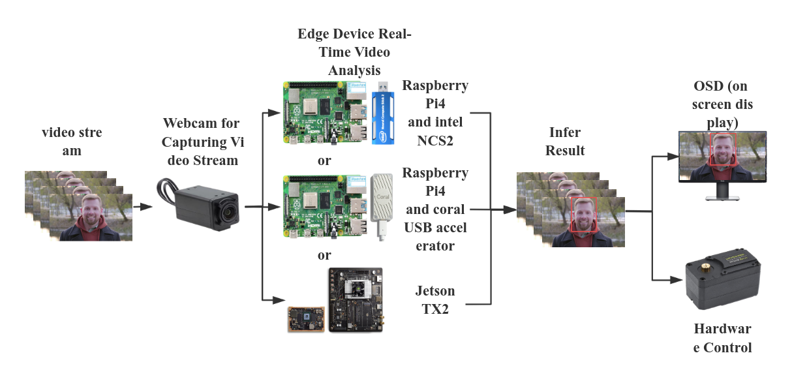
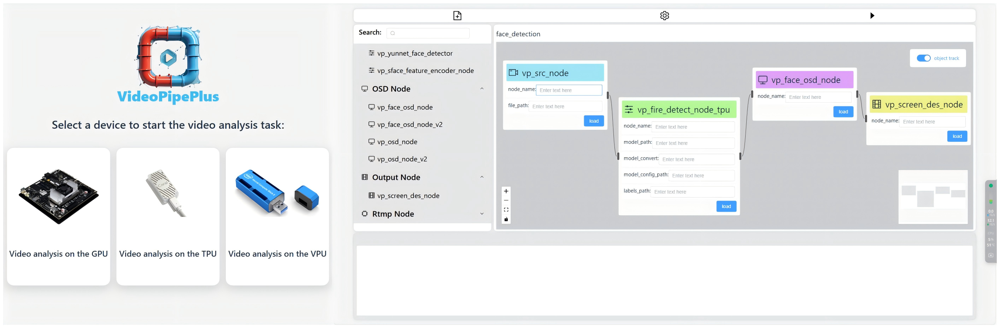
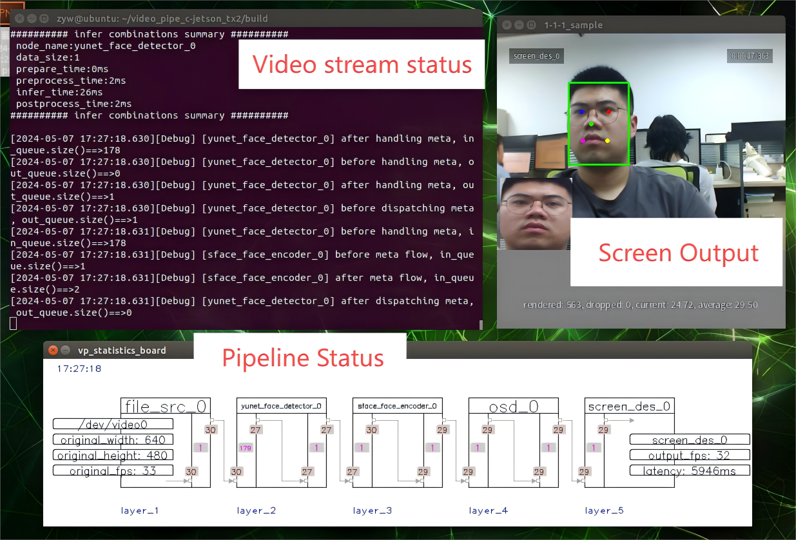

## Introduction
`videopipeplus` is a intelligent video analytics framework for edge heterogeneous devices, improved based on the open source project <a href='https://github.com/sherlockchou86/VideoPipe'>VideoPipe</a>，written in C++. It has three key advantages: high hardware adaptability, low development barriers, and external hardware integration. The framework utilizes a modular design to support various edge hardware acceleration devices, allowing flexible adaptation to resource-constrained edge environments. Its model conversion module facilitates cross-device model portability, simplifying deployment. Additionally, the graphical development environment enables users to quickly build video analysis pipelines through intuitive operations, significantly lowering the technical barrier. The framework also supports real-time interaction with external devices, enhancing automation and responsiveness. `Videopipeplus` can be used to build different types of video analysis applications, suitable for scenarios such as video structuring, image search, face recognition, and behavior analysis in many fields.

<p style="" align="center">
  
</p>

## Advantages and Features

`Videopipeplus` is similar to NVIDIA's DeepStream and Huawei's mxVision frameworks, however, it has three advantages over other frameworks: high hardware adaptability, low development barriers, and external hardware integration.

### high hardware adaptability

Here is a comparison table:

| **Name**      | **Open Source** | **Learning Curve** | **Supported Platforms** | **Performance** |
|---------------|-----------------|---------------------|--------------------------|-----------------|
| DeepStream    | No              | High                | NVIDIA only              | High            |
| mxVision      | No              | High                | Huawei only              | High            |
| VideoPipe     | Yes             | Low                 | GPU/VPU/TPU              | Medium          |

Here is a hardware hardware architecture of Videopipeplus:

<p style="" align="center">
  
</p>

`Videopipeplus` can achieve real-time video analysis tasks on a variety of edge heterogeneous devices. A variety of inference engines are integrated within the framework. The inference engines can be selected according to the changes of the scene and model to achieve video analysis on different devices.

### low development barriers

`videopipeplus` provides a convenient graphical development environment, which can realize drag-and-drop video analysis pipeline to achieve real-time video analysis, greatly reducing the difficulty of video analysis task development and improving efficiency.

The following is a graphical development interface:



### external hardware integration

[https://github.com/zyw0904/videpipeplus/blob/master/docs/b27c4670ddde48328622ad71640f4bdb-%E6%88%AA%E5%8F%96%E8%A7%86%E9%A2%91-20241011013143.mp4](https://github.com/user-attachments/assets/a7338ac8-a598-4588-8f3f-d21ceea5f0d2)

`videopipeplus` also supports real-time hardware control, which can realize the linkage operation between the software layer and the hardware layer. As shown in the above video, the steering gear can be controlled according to the detected target to ensure the integrity of the target.

## Demonstration

What this video contains: Video analysis on different devices using a graphical development interface, including real-time control of external hardware hardware.

## Dependencies

Platforms
- Ubuntu 18.04 aarch64 NVIDIA jetson serials device，tx2 GPU
- Raspberry Pi OS aarch64 Raspberry Pi 4， Intel NCS2 VPU
- Raspberry Pi OS aarch64 Raspberry Pi 4， Coral USB Accelerator TPU

Basics
- C++ 17
- OpenCV >= 4.6
- GStreamer 1.14.5 (Required by OpenCV)
- GCC >= 7.5
- Tensorflow lite
- Openvino
- Onnxruntime

## Compilation and Debugging

### Build

- Build VideoPipe (via shell)
    - Go to the videopipeplus folder
    - run `cd build/`
    - run `sh build.sh`
    - it will generate a library called `libvp.so` and copy it to `/usr/local/lib` automatically.

#### Build samples

```shell
mkdir build # if not exist
cd build
cmake ..
make
```
You will get dynamic libraries and executable samples in `build`.

#### Debug
Use IDEs which will read the `CMakeLists.txt` and generate debug configurations.

## How to use 

Here’s a guide on how to build and run a sample pipeline with `Videopipeplus`. You can either compile `Videopipeplus` as a library and link it, or directly include the source code and compile the entire application.

Below is a sample code demonstrating how to construct a pipeline and run it. Please make sure to update the file paths in the code accordingly:

```c++
#include "../nodes/vp_file_src_node.h"
#include "../nodes/infers/vp_yunet_face_detector_node.h"
#include "../nodes/infers/vp_sface_feature_encoder_node.h"
#include "../nodes/osd/vp_face_osd_node_v2.h"
#include "../nodes/vp_screen_des_node.h"
#include "../utils/analysis_board/vp_analysis_board.h"

/*
* Name: 1-1-N Sample
* Complete code located at: samples/1-1-N_sample.cpp
* Functionality: 1 video input, 1 video analysis task (face detection and recognition), 2 outputs (screen display/RTMP stream)
*/

int main() {
    VP_SET_LOG_INCLUDE_CODE_LOCATION(false);
    VP_SET_LOG_INCLUDE_THREAD_ID(false);
    VP_LOGGER_INIT();

    // 1. Create nodes
    // Video Source Node
    auto file_src_0 = std::make_shared<vp_nodes::vp_file_src_node>("file_src_0", 0, "./test_video/10.mp4", 0.6);
    
    // 2. Model Inference Nodes
    // First-level inference: Face detection
    auto yunet_face_detector_0 = std::make_shared<vp_nodes::vp_yunet_face_detector_node>("yunet_face_detector_0", "./models/face/face_detection_yunet_2022mar.onnx");
    // Second-level inference: Face recognition
    auto sface_face_encoder_0 = std::make_shared<vp_nodes::vp_sface_feature_encoder_node>("sface_face_encoder_0", "./models/face/face_recognition_sface_2021dec.onnx");
    
    // 3. OSD Node
    // Draw results on frames
    auto osd_0 = std::make_shared<vp_nodes::vp_face_osd_node_v2>("osd_0");
    
    // Screen Display Node
    auto screen_des_0 = std::make_shared<vp_nodes::vp_screen_des_node>("screen_des_0", 0);

    // Build the pipeline by linking the nodes
    yunet_face_detector_0->attach_to({file_src_0});
    sface_face_encoder_0->attach_to({yunet_face_detector_0});
    osd_0->attach_to({sface_face_encoder_0});

    // Split the pipeline automatically to display results on screen and stream via RTMP
    screen_des_0->attach_to({osd_0});

    // Start the pipeline
    file_src_0->start();

    // Visualize the pipeline
    vp_utils::vp_analysis_board board({file_src_0});
    board.display();
}
```

**Note**: Running this code will show three displays:
1. **Pipeline Status**: A live update of the pipeline’s status.
2. **Screen Output**: The GUI display showing results.
3. **Video stream status**：The running status of each frame of the video stream.



## Thanks
<a href='https://github.com/sherlockchou86/VideoPipe' target="_blank"></a>
